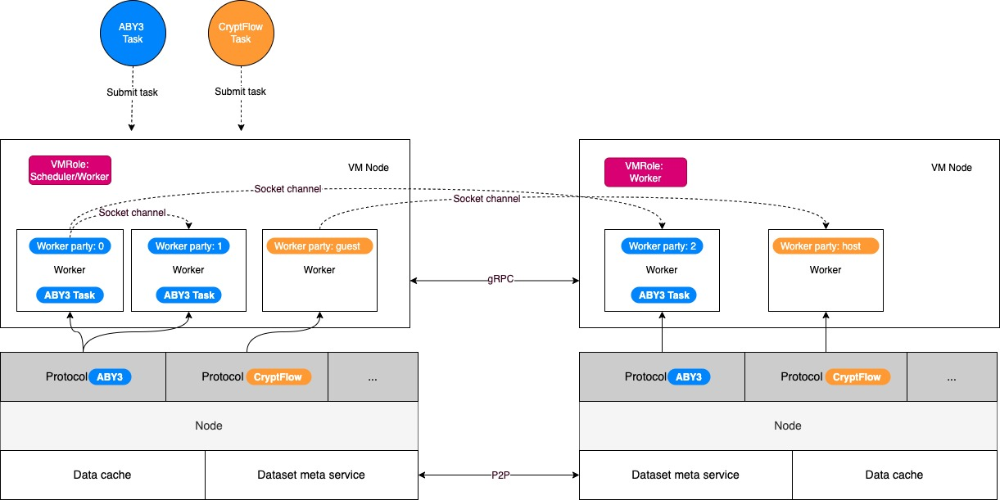

# 核心模型

*** 初步了解Primihub是如何工作的 ***

- 节点（ Node）：一个加载安全协议和接收计算请求的可执行程序, 节点为上层协议执行提供基础服务，目前提供的基础服务有数据集元数据服务、数据缓存服务；
- 协议 （Protocol）：指多方安全计算MPC协议
- 虚拟节点（VMNode）：虚拟节点是节点上所有任务的执行器
- 虚拟节点的角色 （VMNode role）：指在一次任务执行中扮演的角色，分为两种 a.控制节点（Scheduler） b.工作节点（Worker）
- 数据集（Dataset）：指任务需要计算的数据
- 算法（ Algorithm）：指任务执行的具体逻辑，将根据协议分配到指定节点上执行
- 任务 （Task）：特定协议正在执行的MPC计算任务，一个计算任务需要指定算法、数据集、协议（协议可自动由节点根据算法自动协商或人工指定）
- 运行时 （Worker）：任务（Task）的加载和运行器，一个运行时在启动时由VMNode分配使用的协议（Protocol）；
- 运行时参与角色（Worker party）：运行时角色根据传入的安全协议指定与安全协议相关的角色

## 核心模型如何工作

